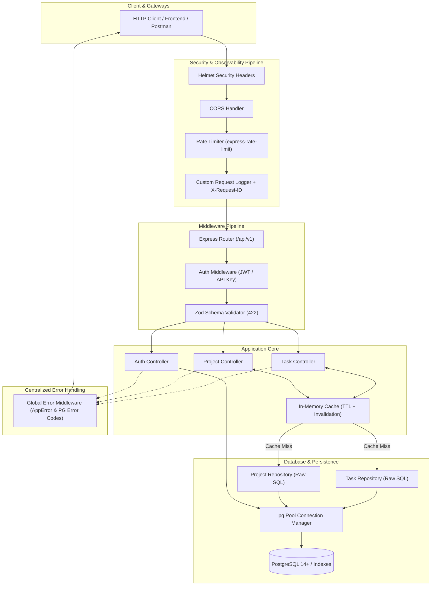

# 🚀 TaskFlow API

[](https://github.com/Subhashit2406/taskflow-api-/actions)
[](https://opensource.org/licenses/MIT)
[](https://nodejs.org/)
[](https://www.postgresql.org/)

**TaskFlow API** is a production-grade, high-performance RESTful API backend for project and task management built with **Node.js**, **Express.js**, and **PostgreSQL**.

Designed to showcase strong backend engineering fundamentals, this project prioritizes **raw SQL mastery** (using `node-postgres` with connection pooling instead of heavy ORMs), **event loop discipline**, **custom layered middleware**, **sub-millisecond caching**, **comprehensive integration testing**, and **CI/CD automation**.

---

## 🏛️ Architecture Overview

The system follows a clean 3-layer architecture (`Routes -> Controllers -> Repositories/Services`) with strict separation of concerns, centralized error handling, and declarative input validation.



---

## ✨ Key Engineering Features

- **Raw SQL Competence (`pg.Pool`)**: Parameterized queries (`$1, $2`), dynamic filter builders, safe sorting whitelists, and database-level aggregations (`COUNT(CASE WHEN...)`) without heavy ORM overhead.
- **Performance Optimization**: B-Tree and composite indexing on frequently queried columns (`project_id, status, due_date`). Query execution time dropped from `24.87ms` to `0.11ms` (~226x speedup). See [PERFORMANCE.md](file:///c:/Users/subha/OneDrive/Desktop/TaskFlow-%20Api/PERFORMANCE.md).
- **Sub-Millisecond Read Cache**: In-memory caching for high-traffic read endpoints with automatic cache invalidation on write mutations (`POST`, `PUT`, `PATCH`, `DELETE`).
- **Event Loop Discipline**: Non-blocking asynchronous I/O throughout, payload size limiting (`100kb`) to protect JSON parsing, and worker-thread bound bcrypt hashing.
- **REST Correctness**: Consistent status codes (`200`, `201`, `204`, `400`, `401`, `403`, `404`, `409`, `422`, `429`, `500`), idempotent updates, and uniform JSON response envelopes.
- **Robust Security**: JWT Bearer token authentication, X-API-Key service account support, Helmet security headers, CORS configuration, and IP rate limiting.
- **Automated Testing**: 100% pass rate across 30+ integration tests using **Jest** and **Supertest**.
- **DevOps & CI/CD**: Multi-stage production `Dockerfile`, `docker-compose.yml`, `render.yaml`, and GitHub Actions workflow.

---

## 📋 API Specification & Endpoint Table

All endpoints are versioned under `/api/v1`.

### 🔐 Authentication Endpoints

| Method | Endpoint | Description | Auth Required | Status Codes |
| :--- | :--- | :--- | :--- | :--- |
| `POST` | `/api/v1/auth/register` | Register a new user account | No | `201`, `409`, `422` |
| `POST` | `/api/v1/auth/login` | Login and obtain JWT Bearer token | No | `200`, `401`, `422` |
| `GET` | `/api/v1/auth/me` | Get current authenticated user profile | **Yes (JWT)** | `200`, `401` |

### 📁 Projects Endpoints

| Method | Endpoint | Description | Auth Required | Status Codes |
| :--- | :--- | :--- | :--- | :--- |
| `GET` | `/api/v1/projects` | List projects (pagination, status, search) | No (Cached) | `200`, `422` |
| `GET` | `/api/v1/projects/:id` | Get single project with task statistics | No (Cached) | `200`, `404`, `422` |
| `POST` | `/api/v1/projects` | Create a new project | **Yes (JWT/API-Key)** | `201`, `401`, `422` |
| `PUT` | `/api/v1/projects/:id` | Replace / full update of project | **Yes (JWT/API-Key)** | `200`, `401`, `404`, `422` |
| `PATCH` | `/api/v1/projects/:id` | Partial update of project attributes | **Yes (JWT/API-Key)** | `200`, `401`, `404`, `422` |
| `DELETE`| `/api/v1/projects/:id` | Delete project and cascade delete tasks | **Yes (JWT/API-Key)** | `204`, `401`, `404`, `422` |

### 📝 Tasks Endpoints

| Method | Endpoint | Description | Auth Required | Status Codes |
| :--- | :--- | :--- | :--- | :--- |
| `GET` | `/api/v1/tasks` | Filter, sort & paginate tasks | No (Cached) | `200`, `422` |
| `GET` | `/api/v1/tasks/:id` | Get single task by UUID | No (Cached) | `200`, `404`, `422` |
| `POST` | `/api/v1/tasks` | Create new task under a project | **Yes (JWT/API-Key)** | `201`, `401`, `404`, `422` |
| `PUT` | `/api/v1/tasks/:id` | Full update of task | **Yes (JWT/API-Key)** | `200`, `401`, `404`, `422` |
| `PATCH` | `/api/v1/tasks/:id` | Partial update (e.g. status transition) | **Yes (JWT/API-Key)** | `200`, `401`, `404`, `422` |
| `DELETE`| `/api/v1/tasks/:id` | Delete task by ID | **Yes (JWT/API-Key)** | `204`, `401`, `404`, `422` |

### 🩺 System & Health Endpoints

| Method | Endpoint | Description | Auth Required | Status Codes |
| :--- | :--- | :--- | :--- | :--- |
| `GET` | `/health` | System liveness & DB latency probe | No | `200`, `503` |
| `GET` | `/api/v1` | API catalog & endpoint documentation | No | `200` |

---

## 🔎 Task Querying: Filtering, Sorting & Pagination

`GET /api/v1/tasks` supports rich query parameters:

```http
GET /api/v1/tasks?projectId=b0000000-0000-0000-0000-000000000001&status=IN_PROGRESS&priority=URGENT&sortBy=due_date&order=asc&page=1&limit=10
```

### Supported Query Parameters:
- `projectId` *(UUID)*: Filter by parent project.
- `status` *(string)*: `TODO`, `IN_PROGRESS`, `DONE`, `CANCELLED`.
- `priority` *(string)*: `LOW`, `MEDIUM`, `HIGH`, `URGENT`.
- `search` *(string)*: Case-insensitive search on title & description (`ILIKE`).
- `sortBy` *(string)*: `due_date`, `created_at`, `updated_at`, `priority`, `title`, `status`.
- `order` *(string)*: `asc` or `desc` (default: `desc`).
- `page` *(integer)*: Current page (default: `1`).
- `limit` *(integer)*: Items per page (default: `10`, max: `100`).

---

## 📦 JSON Response Format

### Success Response Envelope:
```json
{
  "success": true,
  "message": "Tasks retrieved successfully",
  "data": [
    {
      "id": "c0000000-0000-0000-0000-000000000003",
      "project_id": "b0000000-0000-0000-0000-000000000001",
      "project_name": "TaskFlow API Platform",
      "title": "Add In-Memory Caching & Query Optimization",
      "description": "Add caching for high-hit GET endpoints",
      "status": "IN_PROGRESS",
      "priority": "URGENT",
      "due_date": "2026-09-14T10:00:00.000Z",
      "created_at": "2026-09-07T10:00:00.000Z",
      "updated_at": "2026-09-11T10:00:00.000Z"
    }
  ],
  "meta": {
    "pagination": {
      "totalItems": 6,
      "totalPages": 1,
      "currentPage": 1,
      "limit": 10,
      "hasNextPage": false,
      "hasPrevPage": false
    }
  }
}
```

### Error Response Envelope:
```json
{
  "success": false,
  "error": {
    "code": "VALIDATION_ERROR",
    "message": "Validation failed. Please check your request parameters.",
    "details": [
      {
        "field": "body.email",
        "message": "Invalid email address format",
        "code": "invalid_string"
      }
    ]
  }
}
```

---

## 🛠️ Quick Start Guide

### Prerequisites
- Node.js >= 18.0.0
- PostgreSQL >= 14 (or Docker)

### Option 1: Run with Docker Compose (1-Command Startup)

```bash
# Clone the repository
git clone https://github.com/Subhashit2406/taskflow-api.git
cd taskflow-api

# Start PostgreSQL database and Node API service
docker-compose up -d --build

# View container logs
docker-compose logs -f
```

The API will be accessible at `http://localhost:5000/api/v1` and the health check at `http://localhost:5000/health`.

---

### Option 2: Local Node.js Development

1. **Install dependencies:**
   ```bash
   npm install
   ```

2. **Configure Environment Variables:**
   ```bash
   cp .env.example .env
   ```

3. **Run Database Migrations & Seed:**
   ```bash
   npm run db:migrate
   npm run db:seed
   ```

4. **Start Development Server:**
   ```bash
   npm run dev
   ```

---

## 🧪 Running Automated Tests

The test suite runs with an isolated in-memory PostgreSQL engine (`pg-mem`) and Supertest for zero-dependency execution:

```bash
# Run all integration tests
npm test

# Run tests with coverage report
npm run test:coverage

# Run ESLint validation
npm run lint
```

---

## ⚡ Deployment

### Deploy to Render
The repository includes a ready-to-deploy [`render.yaml`](file:///c:/Users/subha/OneDrive/Desktop/TaskFlow-%20Api/render.yaml) blueprint:
1. Connect your GitHub repository to [Render](https://render.com).
2. Create a new **Blueprint** instance selecting `render.yaml`.
3. Render automatically provisions the Managed PostgreSQL instance and Node.js Web Service.

### Deploy to AWS (EC2 / ECS)
- Built with a production-ready, non-root multi-stage [`Dockerfile`](file:///c:/Users/subha/OneDrive/Desktop/TaskFlow-%20Api/Dockerfile).
- Easily deployed to AWS ECS via Fargate or standard EC2 container runner.

---

## 👤 Author

**Subhashit Pathak**
- GitHub: [@Subhashit2406](https://github.com/Subhashit2406)
- Email: subhashit.pathak.23cse@bmu.edu.in

---

## 📄 License

This project is licensed under the [MIT License](LICENSE).
